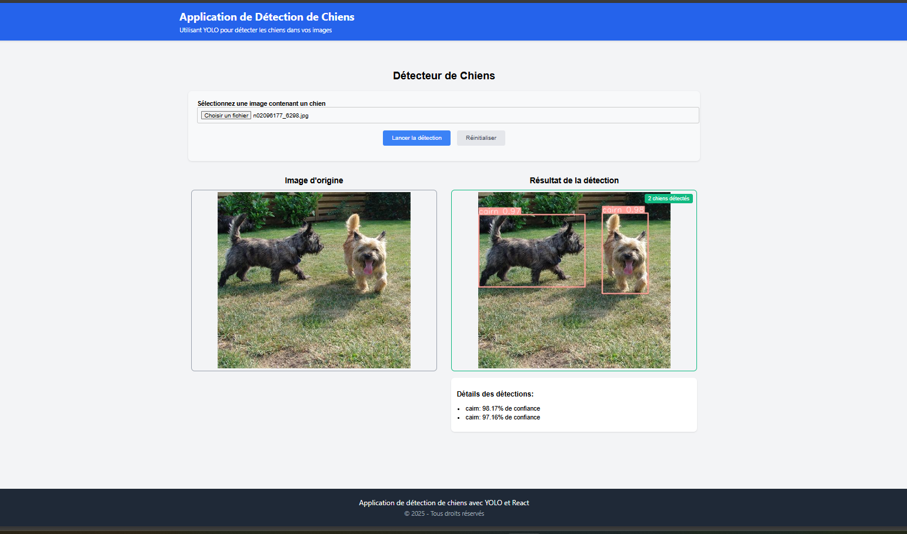
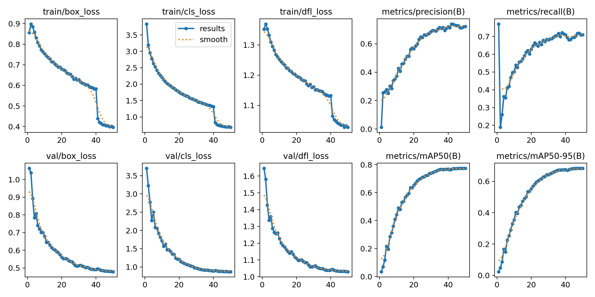

# Application de Détection de Chiens avec YOLO, React et Flask

Cette application web permet aux utilisateurs de télécharger des images pour détecter les chiens à l'aide d'un modèle YOLO pré-entraîné. Le système utilise un backend Flask pour le traitement des images et un frontend React pour l'interface utilisateur.

## Fonctionnalités

- Interface utilisateur intuitive pour télécharger des images
- Détection des chiens grâce au modèle YOLO
- Affichage des résultats avec les boîtes de délimitation (bounding boxes)
- Affichage des informations de confiance pour chaque détection
- Possibilité de réinitialiser et de sélectionner de nouvelles images

## Architecture

L'application est divisée en deux parties principales :

### Backend (Flask)

- Reçoit les images téléchargées depuis le frontend
- Utilise le modèle YOLO pour détecter les chiens dans les images
- Génère une image de résultat avec les boîtes de délimitation
- Renvoie les résultats au frontend au format JSON

### Frontend (React)

- Interface utilisateur responsive et conviviale
- Permet le téléchargement d'images
- Affiche l'image originale et l'image avec les détections
- Affiche les détails des détections (classe et niveau de confiance)

## Prérequis

- Python 3.7 ou version ultérieure
- Node.js 14 ou version ultérieure
- pip (gestionnaire de paquets Python)
- npm (gestionnaire de paquets Node.js)

## Installation

### Backend (Flask)

1. Clonez le dépôt et naviguez vers le dossier `backend` :
```bash
git clone <URL_DU_DEPOT>
cd <NOM_DU_PROJET>/backend
```

2. Créez et activez un environnement virtuel (recommandé) :
```bash
# Sur Windows
python -m venv venv
venv\Scripts\activate

# Sur macOS/Linux
python3 -m venv venv
source venv/bin/activate
```

3. Installez les dépendances nécessaires :
```bash
pip install flask flask-cors opencv-python pillow ultralytics numpy
```

4. Assurez-vous que votre modèle YOLO est correctement placé dans le chemin spécifié dans `app.py` (par défaut : "yolov8n-dogs/weights/best.pt").

5. Lancez le serveur Flask :
```bash
python app.py
```

Le serveur Flask démarrera sur http://localhost:5000.

### Frontend (React)

1. Naviguez vers le dossier `frontend` :
```bash
cd <NOM_DU_PROJET>/frontend
```

2. Installez les dépendances :
```bash
npm install
```

3. Lancez l'application React :
```bash
npm start
```

L'application React démarrera sur http://localhost:3000.

## Utilisation

1. Ouvrez votre navigateur et accédez à http://localhost:3000
2. Cliquez sur le bouton de sélection de fichier pour télécharger une image
3. Cliquez sur "Lancer la détection" pour analyser l'image
4. Consultez les résultats affichés avec les détections de chiens
5. Utilisez le bouton "Réinitialiser" pour sélectionner une nouvelle image

## Structure des fichiers

```
project-root/
├── backend/
│   └── app.py             # Serveur Flask et logique de détection YOLO
│
├── frontend/
│   ├── public/
│   └── src/
│       ├── components/
│       │   ├── DogDetector.jsx  # Composant principal
│       │   └── DogDetector.css  # Styles du composant
│       ├── App.js          # Point d'entrée de l'application React
│       ├── App.css         # Styles généraux
│       ├── index.js        # Point d'entrée React
│       └── index.css       # Styles de base
```
## La préparation des données
Pour ce projet, j'ai utilisé le Stanford Dogs Dataset, un ensemble de plus de 20 000 images réparties sur 120 races de chiens, idéal pour la classification fine.
Le Stanford Dogs Dataset est composé de :

20 580 images au total,

120 races de chiens différentes,

Annotations sous forme de fichiers .xml: 

Chaque fichier .xml contient :
                              . Le nom de la race (classe de l'image),
                              . La bounding box (les coordonnées xmin, ymin, xmax, ymax pour localiser le chien dans l'image).


En résumé : il contient des images + labels de races + boîtes englobantes.les extensions des fichier :  Images → .jpg , Annotations → .xml

Comme j'ai utilisé le modèle YOLO, qui attend des annotations au format .txt, j'ai extrait à partir des fichiers .xml le numéro de la classe  et les coordonnées des boîtes englobantes, en les convertissant dans le format YOLO : un fichier .txt par image contenant la classe et la bounding box normalisée.

## model yoloV8
YOLOv8 est un modèle d'intelligence artificielle pour la détection d'objets, 
Il peut faire plusieurs tâches :

Détection d'objets (trouver et classer les objets dans une image),

Segmentation (découper précisément les objets),


YOLOv8 est basé sur une architecture de type CNN (Convolutional Neural Network), car elle traite des images pour détecter et localiser des objets. développé par Ultralytics.
C'est une évolution de la série YOLO (You Only Look Once), connu pour être rapide et précis.
YOLOv8 est entièrement reconstruit en PyTorch, avec une nouvelle architecture plus flexible.

Entraînement initial de yolov8:
YOLOv8 a été pré-entraîné principalement sur de grands datasets comme COCO.

#### COCO, c’est quoi ?

COCO signifie "Common Objects in Context",

C’est un grand dataset d’images réelles,

Il contient environ 123287 images d’entraînement,

Et plus de 80 classes d’objets (personnes, voitures, animaux, etc.),

COCO est utilisé pour entraîner des modèles capables de détecter une grande variété d’objets dans des scènes naturelles.

Dans notre cas, nous avons appliqué le fine-tuning au modèle YOLOv8 pour l'adapter à notre dataset spécifique.

Paramètres du modèle :
Le nombre de paramètres dépend de la taille du modèle que tu choisis :

YOLOv8n (nano) : environ 3 millions de paramètres,

YOLOv8s (small) : environ 11 millions,

YOLOv8m (medium) : environ 25 millions,

YOLOv8l (large) : environ 43 millions,

YOLOv8x (extra large) : environ 68 millions.


#### Fine-tuning, c’est quoi ?

Le fine-tuning consiste à prendre un modèle déjà pré-entraîné (comme YOLOv8 entraîné sur COCO) et à l'adapter à un nouveau dataset spécifique (comme mon dataset Stanford Dogs).

Cela permet d’obtenir de meilleures performances plus rapidement que d’entraîner un modèle à partir de zéro.

Pendant le fine-tuning, on ajuste seulement une partie ou la totalité du modèle pour qu'il apprenne à reconnaître les nouvelles classes ou à s'adapter à de nouvelles données.

#### Passage de la Classification à la Détection d'Objets
Au départ, le projet m'avait demandé de réaliser une classification d'images, c'est-à-dire d'identifier la race d'un chien dans chaque image. Cependant, en examinant les images du dataset, j'ai constaté que certaines images contenaient deux chiens ou plus. Cela a conduit à un changement de direction : au lieu de simplement classer les images, nous avons décidé de relever le défi et de passer à une détection d'objets.

Ainsi, nous avons adapté le modèle YOLOv8 pour non seulement classer les chiens par race, mais aussi pour localiser et identifier plusieurs chiens présents dans une seule image, en générant des boîtes englobantes pour chaque chien détecté.

#### Pour la préparation des données
Comme mentionné précédemment, la première étape de la préparation des données a consisté à extraire les classes et les boîtes englobantes des fichiers d'annotations et à les convertir dans des fichiers .txt. Ensuite, nous avons réparti les images en trois ensembles : 70 % pour l'entraînement, 15 % pour la validation et 15 % pour le test. Nous n'avons pas procédé à un redimensionnement ou à une manipulation manuelle des images, car YOLO prend en charge automatiquement ces étapes durant l'entraînement, comme le redimensionnement des images à 640x640 pixels et la normalisation des valeurs des pixels.

Enfin, nous avons créé le fichier data.yaml afin de permettre à YOLO de charger correctement le dataset, d'identifier les classes et de localiser les images et annotations nécessaires à l'entraînement et à la validation du modèle.

#### l'entraînement du modèle
nous avons entraîné ce modèle sur le dataset en utilisant les paramètres suivants :

data.yaml 
epochs=50 : nous avons effectué 50 passes (époques) sur l'ensemble du dataset.
imgsz=640 : les images ont été redimensionnées à 640x640 pixels pour l'entraînement.
batch=16 : le modèle a utilisé une taille de batch de 16 images à chaque itération.
device='cpu' : initialement, nous avons utilisé le processeur pour l'entraînement. Cependant, nous avons ensuite opté pour le GPU de Kaggle, qui offre 30 heures gratuites d’utilisation de ressources GPU pour accélérer l'entraînement.

Le modèle a été entraîné avec l'option pretrained=True, ce qui signifie qu'il a bénéficié des poids pré-existants du modèle YOLOv8, permettant d'améliorer les performances sur notre dataset. Enfin, nous avons activé l'option verbose=True pour suivre les progrès de l'entraînement et plots=True pour visualiser les courbes de loss et de précision, ce qui nous a permis de suivre l'évolution de l'apprentissage en temps réel.
#### résultat obtenu
À la fin de l'entraînement, les résultats obtenus étaient les suivants : **précision de 0,71**, **rappel de 0,71** et **mAP@50 de 0,77**.


## Personnalisation

### Modèle YOLO

Pour utiliser un modèle YOLO différent ou personnalisé, modifiez la ligne suivante dans `app.py` :

```python
model = YOLO("chemin/vers/votre/modele.pt")
```

### Interface utilisateur

L'interface utilisateur peut être personnalisée en modifiant les fichiers CSS correspondants dans le dossier `frontend/src/`.

## Dépannage

### Problème de connexion au backend

Si le frontend ne parvient pas à se connecter au backend, vérifiez que :
- Le serveur Flask est bien en cours d'exécution sur le port 5000
- CORS est correctement configuré dans le backend
- L'URL de l'API dans le frontend pointe vers la bonne adresse

### Erreurs de détection

Si la détection des chiens ne fonctionne pas correctement :
- Vérifiez que le modèle YOLO est correctement chargé
- Assurez-vous que le chemin vers le modèle est correct
- Vérifiez que l'image est correctement envoyée au backend

## Licence

Ce projet est sous licence [MIT](LICENSE).

## Auteurs

- Boussad AIT DJOUDI
- Theo personne
- Akram CHOUICHI

## Remerciements

- Ultralytics pour la bibliothèque YOLO
- L'équipe React pour le framework frontend
- L'équipe Flask pour le framework backend
